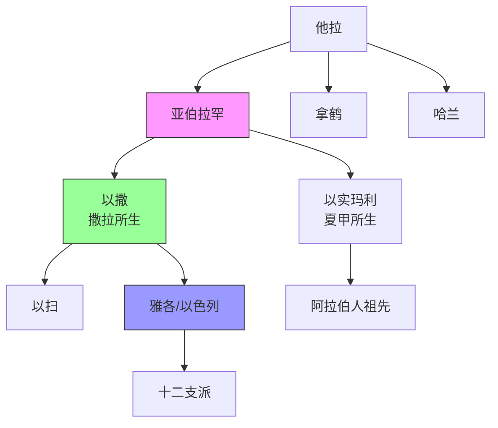
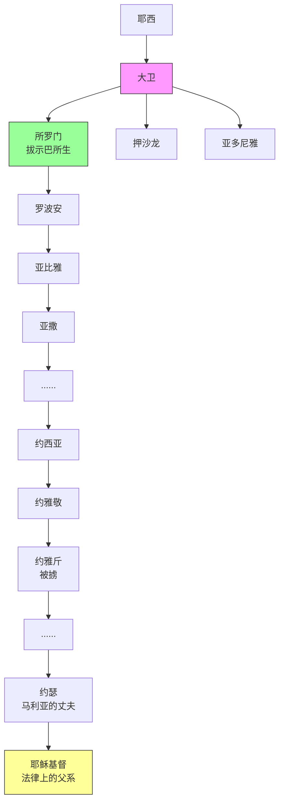
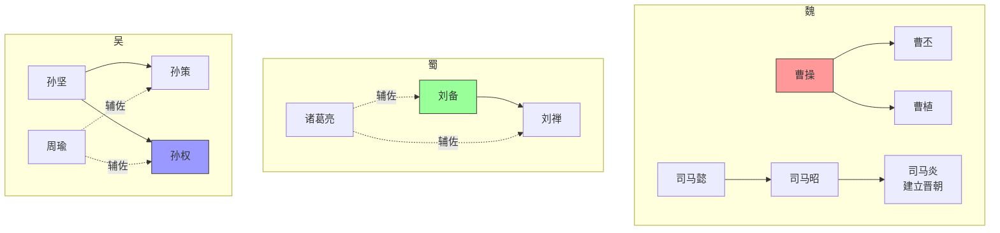

# 附录：地图与图表

> 本附录提供圣经世界与中国历史的地图、时间线对照、人物关系图等视觉资源。

---

## 目录

1. [圣经世界地图](#一圣经世界地图)
2. [中国历史地图](#二中国历史地图)
3. [时间线对照图表](#三时间线对照图表)
4. [人物关系图](#四人物关系图)
5. [神学概念图表](#五神学概念图表)

---

## 一、圣经世界地图

### 1. 古代近东全图

```
                              黑 海
                         ┌─────────────────┐
                         │                 │
              ┌──────────┤    小亚细亚      │
              │          │   (土耳其)       │
      地      │          └────────┬────────┘
              │     以弗所●        │
      中      │                   │哈兰●
              │    安提阿●        ├────────┐
      海      │                   │ 亚述   │    ●尼尼微
              │    ┌──────────────┤        │
              │    │              │ 巴比伦 │────●巴比伦
      ┌───────┤    │   叙利亚     │        │
      │       │    │              │  波斯  │────●书珊
      │ 埃    │    │    ●大马士革  │        │
      │ 及    │    │              │        │
      │       │    │   ●耶路撒冷   └────────┘
      │ ●     │    │   以色列/犹大
      │ 孟    │    │
      │ 菲    │    │   ●以旬迦别
      │ 斯    │    │
      │       │    │        阿拉伯沙漠
      │ ●     │    │
      │ 底    │    │
      │ 比    └────┘
      │ 斯
      └───────
           红 海
```

### 2. 以色列地图（分国时期）

```
                    地 中 海
                         │
        ┌────────────────┼────────────────┐
        │                │                │
        │      ●推罗     │                │
        │                │      ●大马士革  │
        │    ●西顿       │                │
        │                │    亚 兰       │
        │  ──────────────┼────────────────│
        │                │                │
        │     加利利●    │                │
        │    ●拿撒勒     │                │
        │                │                │
        │   北 国        │                │
        │  (以色列)      │                │
        │    ●撒玛利亚   │                │
        │                │                │
        │  ──────────────┼────────────────│
        │                │                │
        │   南 国        │                │
        │  (犹 大)       │     摩 押      │
        │    ●耶路撒冷   │                │
        │    ●伯利恒     │                │
        │                │                │
        │    ●希伯仑     │     以 东      │
        │                │                │
        └────────────────┴────────────────┘
                    死 海
```

### 3. 保罗传道旅程图

```
第一次传道旅程 (约46-48 AD)
━━━━━━━━━━━━━━━━━━━━━━━━━━━━━━━━━━━━━━━━━━━━━━━━━━━━━
安提阿 ──→ 塞浦路斯 ──→ 别加 ──→ 彼西底安提阿 ──→
以哥念 ──→ 路司得 ──→ 特庇 ──→ (返回)

第二次传道旅程 (约49-52 AD)
━━━━━━━━━━━━━━━━━━━━━━━━━━━━━━━━━━━━━━━━━━━━━━━━━━━━━
安提阿 ──→ 特庇/路司得 ──→ 特罗亚 ──→ 腓立比 ──→
帖撒罗尼迦 ──→ 庇哩亚 ──→ 雅典 ──→ 哥林多 ──→ 以弗所 ──→
(返回安提阿)

第三次传道旅程 (约53-58 AD)
━━━━━━━━━━━━━━━━━━━━━━━━━━━━━━━━━━━━━━━━━━━━━━━━━━━━━
安提阿 ──→ 加拉太/弗吕家 ──→ 以弗所(3年) ──→
马其顿 ──→ 希腊 ──→ 特罗亚 ──→ 米利都 ──→ 耶路撒冷
```

---

## 二、中国历史地图

### 1. 战国七雄

```
                              燕
                         ┌─────────┐
                         │  ●蓟    │
                    赵   │         │
               ┌────────┴─────┐   │
               │    ●邯郸     │   │
          秦   │              │   │
     ┌────────┤    魏        │   │
     │ ●咸阳  │  ┌─────┐    │   │
     │        │  │●大梁│    │   │     齐
     │        │  └──┬──┘    │   │  ┌────────┐
     │        │  韩 │        │   │  │ ●临淄  │
     │        │┌───┴───┐    └───┴──┤        │
     │        ││●新郑 │           │        │
     │        │└───────┘           │        │
     │        │                    └────────┘
     │   楚   │
     │  ┌────┴────────────────────────┐
     │  │              ●郢            │
     │  │                             │
     └──┴─────────────────────────────┘
```

### 2. 三国鼎立

```
              魏 (曹操→曹丕)
         ┌───────────────────────┐
         │       ●洛阳           │
         │                       │
    蜀   │                       │      吴
   (刘备) │                       │    (孙权)
  ┌──────┤                       ├──────────┐
  │●成都 │                       │    ●建业 │
  │      │                       │  (南京)  │
  │      │                       │          │
  │      │                       │          │
  └──────┴───────────────────────┴──────────┘

  赤壁之战 (208 AD) ──→ 三分天下
```

### 3. 唐朝疆域

```
┌─────────────────────────────────────────────────────────┐
│                                                         │
│         西域都护府                                        │
│     ┌────────────┐                                      │
│     │            │        安北都护府                     │
│     │   ●龟兹    │      ┌──────────┐                    │
│     │            │      │          │                    │
│     └────┬───────┘      │          │                    │
│          │              │          │                    │
│          │         唐 朝 本 土      │                    │
│          │    ┌─────────────────┐  │                    │
│          │    │                 │  │                    │
│          └────┤    ●长安       │──┘                    │
│               │    ●洛阳       │                        │
│               │                 │                        │
│               │                 │     安东都护府          │
│               └────────┬────────┘   ┌────────┐          │
│                        │           │        │          │
│                   安南都护府        │●平壤   │          │
│                   ┌────┴───┐       │        │          │
│                   │        │       └────────┘          │
│                   │●交州   │                            │
│                   └────────┘                            │
└─────────────────────────────────────────────────────────┘
```

---

## 三、时间线对照图表

### 1. 圣经与中国历史大事年表

```
圣经历史                年代(BC/AD)              中国历史
━━━━━━━━━━━━━━━━━━━━━━━━━━━━━━━━━━━━━━━━━━━━━━━━━━━━━━━━━━━━━━━━━━━━━━
                        约前2070                  夏朝建立
亚伯拉罕 ←──────────── 约前2000 ──────────────→
                        约前1600                  商朝建立
约瑟在埃及 ←─────────── 约前1700-1600 ─────────→
出埃及 ←─────────────── 约前1446 ─────────────→
                        约前1046                  周朝建立
士师时代 ←────────────── 前1375-1050 ───────────→
扫罗、大卫 ←─────────── 约前1050-970 ──────────→
所罗门建殿 ←─────────── 前966 ────────────────→
王国分裂 ←────────────── 前931 ────────────────→
                        前770                     东周/春秋开始
以赛亚 ←─────────────── 约前740-700 ───────────→ 齐桓公称霸
北国灭亡 ←────────────── 前722 ────────────────→
                        前551                     孔子出生
耶利米、以西结 ←──────── 前626-570 ────────────→
南国灭亡 ←────────────── 前586 ────────────────→
                        前475                     战国开始
被掳归回 ←────────────── 前538 ────────────────→
但以理 ←─────────────── 前605-536 ────────────→
                        前221                     秦统一中国
沉默期 ←─────────────── 前400-5 ─────────────→ 楚汉争霸 (前206)
                        前202                     汉朝建立
耶稣降生 ←────────────── 约前5-4 ─────────────→
耶稣受难复活 ←─────────── 约AD 30-33 ───────────→
保罗传道 ←────────────── AD 47-67 ─────────────→
耶路撒冷毁灭 ←──────────── AD 70 ────────────────→
约翰启示录 ←────────────── AD 95 ────────────────→
                        AD 220                    三国时期开始
━━━━━━━━━━━━━━━━━━━━━━━━━━━━━━━━━━━━━━━━━━━━━━━━━━━━━━━━━━━━━━━━━━━━━━
```

### 2. 先知与中国诸子年表

```
前800年         前700年         前600年         前500年         前400年         前300年
   │               │               │               │               │               │
   ├───────────────┼───────────────┼───────────────┼───────────────┼───────────────┤
   │               │               │               │               │               │
   │  【以赛亚】    │               │               │               │               │
   │  (前740-700)  │               │               │               │               │
   │               │               │               │               │               │
   │               │  【耶利米】    │               │               │               │
   │               │  (前626-586)  │               │               │               │
   │               │               │               │               │               │
   │               │  【以西结】    │               │               │               │
   │               │  (前593-570)  │               │               │               │
   │               │               │               │               │               │
   │               │  【但以理】    │               │               │               │
   │               │  (前605-536)  │               │               │               │
   │               │               │               │               │               │
───┼───────────────┼───────────────┼───────────────┼───────────────┼───────────────┤
   │               │               │               │               │               │
   │               │               │  【孔子】      │               │               │
   │               │               │  (前551-479)  │               │               │
   │               │               │               │               │               │
   │               │               │  【老子】      │               │               │
   │               │               │  (约前571-?)  │               │               │
   │               │               │               │               │               │
   │               │               │               │  【孟子】      │               │
   │               │               │               │  (前372-289)  │               │
   │               │               │               │               │               │
   │               │               │               │  【庄子】      │               │
   │               │               │               │  (前369-286)  │               │
   │               │               │               │               │               │
   │               │               │               │               │  【荀子】      │
   │               │               │               │               │  (前313-238)  │
   │               │               │               │               │               │
   │               │               │               │               │  【韩非子】    │
   │               │               │               │               │  (前280-233)  │
```

### 3. 救赎历史七阶段

```
┌─────────────────────────────────────────────────────────────────────────────┐
│                            救 赎 历 史 七 阶 段                              │
├─────────────────────────────────────────────────────────────────────────────┤
│                                                                             │
│  1. 创造          2. 堕落          3. 洪水/巴别                             │
│  ┌────────┐      ┌────────┐       ┌────────┐                               │
│  │ 伊甸园 │ ──→  │ 犯罪   │  ──→  │ 审判   │                               │
│  │ 神的形像│      │ 咒诅   │       │ 分散   │                               │
│  └────────┘      └────────┘       └────────┘                               │
│       │               │                │                                    │
│       └───────────────┴────────────────┘                                    │
│                       │                                                     │
│                       ▼                                                     │
│  4. 列祖时代      5. 出埃及/西奈    6. 王国时代                             │
│  ┌────────┐      ┌────────┐       ┌────────┐                               │
│  │亚伯拉罕│ ──→  │ 摩西   │  ──→  │大卫/先知│                              │
│  │ 应许   │      │ 律法   │       │ 预言   │                               │
│  └────────┘      └────────┘       └────────┘                               │
│       │               │                │                                    │
│       └───────────────┴────────────────┘                                    │
│                       │                                                     │
│                       ▼                                                     │
│                  7. 基督与教会                                               │
│                  ┌────────────────┐                                         │
│                  │   道成肉身     │                                         │
│                  │   十架复活     │                                         │
│                  │   教会时代     │                                         │
│                  │   基督再来     │                                         │
│                  │   新天新地     │                                         │
│                  └────────────────┘                                         │
│                                                                             │
└─────────────────────────────────────────────────────────────────────────────┘
```

---

## 四、人物关系图

### 1. 亚伯拉罕家族



### 2. 大卫王朝



### 3. 中国三国人物



### 4. 圣经vs中国忠臣对照

```
┌─────────────────────────────────────────────────────────────────┐
│                      忠臣人物对照                                │
├────────────────────────┬────────────────────────────────────────┤
│       圣经人物          │            中国人物                     │
├────────────────────────┼────────────────────────────────────────┤
│                        │                                        │
│   约瑟 ─────────────────────────────── 伊尹                     │
│   (从奴隶到宰相)        │          (从厨师到宰相)                 │
│                        │                                        │
│   但以理 ────────────────────────────── 诸葛亮                   │
│   (忠心谋士)            │          (鞠躬尽瘁)                     │
│                        │                                        │
│   拿单 ─────────────────────────────── 魏征                     │
│   (直言谏君)            │          (犯颜直谏)                     │
│                        │                                        │
│   尼希米 ────────────────────────────── 张居正                   │
│   (改革者)              │          (改革家)                       │
│                        │                                        │
│   以利亚 ────────────────────────────── 海瑞                     │
│   (孤胆先知)            │          (清官直臣)                     │
│                        │                                        │
└────────────────────────┴────────────────────────────────────────┘
```

---

## 五、神学概念图表

### 1. 四大主题关系图

```
┌─────────────────────────────────────────────────────────────────┐
│                        四 大 主 题                               │
├─────────────────────────────────────────────────────────────────┤
│                                                                 │
│                     ┌──────────────┐                            │
│                     │  透视人性    │                            │
│                     │ (人是什么?)  │                            │
│                     └──────┬───────┘                            │
│                            │                                    │
│              ┌─────────────┼─────────────┐                      │
│              │             │             │                      │
│              ▼             │             ▼                      │
│     ┌──────────────┐       │      ┌──────────────┐              │
│     │  寻找出路    │       │      │ 明白属灵争战 │              │
│     │ (如何得救?)  │       │      │ (战争是什么?)│              │
│     └──────┬───────┘       │      └──────┬───────┘              │
│            │               │             │                      │
│            └───────────────┼─────────────┘                      │
│                            │                                    │
│                            ▼                                    │
│                     ┌──────────────┐                            │
│                     │ 认识神的计划 │                            │
│                     │ (历史往何处?)│                            │
│                     └──────────────┘                            │
│                                                                 │
└─────────────────────────────────────────────────────────────────┘
```

### 2. 圣约结构图

```
┌─────────────────────────────────────────────────────────────────┐
│                        圣 约 结 构                               │
├─────────────────────────────────────────────────────────────────┤
│                                                                 │
│   创造之约 ──→ 行为之约                                         │
│   (亚当)       │                                                │
│                │ 堕落                                           │
│                ▼                                                │
│   恩典之约 ──→ 挪亚之约 (普遍恩典)                              │
│   (应许)       │                                                │
│                ▼                                                │
│            亚伯拉罕之约 (应许)                                   │
│                │                                                │
│                ├──→ 摩西之约 (律法)                             │
│                │        │                                       │
│                │        ▼                                       │
│                └──→ 大卫之约 (王国)                             │
│                         │                                       │
│                         │ 预言                                  │
│                         ▼                                       │
│                    新  约 (基督成全)                             │
│                         │                                       │
│                         ▼                                       │
│                    永恒之约 (新天新地)                           │
│                                                                 │
└─────────────────────────────────────────────────────────────────┘
```

### 3. 基督三重职分

```
                         基 督
                           │
         ┌─────────────────┼─────────────────┐
         │                 │                 │
         ▼                 ▼                 ▼
    ┌─────────┐       ┌─────────┐       ┌─────────┐
    │  先知   │       │  祭司   │       │  君王   │
    │ Prophet │       │ Priest  │       │  King   │
    └────┬────┘       └────┬────┘       └────┬────┘
         │                 │                 │
         ▼                 ▼                 ▼
    神的话语           代求赎罪           治理万有
    启示真理           献上自己           公义审判
         │                 │                 │
         ▼                 ▼                 ▼
    ┌─────────┐       ┌─────────┐       ┌─────────┐
    │ 旧约先知 │       │旧约祭司 │       │ 旧约君王│
    │ 预表基督 │       │预表基督 │       │ 预表基督│
    └─────────┘       └─────────┘       └─────────┘
```

### 4. 末世论三观对比

```
┌─────────────────────────────────────────────────────────────────────┐
│                        末 世 论 三 观                                │
├─────────────────────────────────────────────────────────────────────┤
│                                                                     │
│  前千禧年派 (Premillennialism)                                      │
│  ────────────────────────────────────────────────────────────→     │
│  现在 → 大灾难 → 基督再来 → 千年国度 → 最后审判 → 新天新地          │
│                     ↑                                               │
│              基督在千禧年"前"来                                      │
│                                                                     │
├─────────────────────────────────────────────────────────────────────┤
│                                                                     │
│  后千禧年派 (Postmillennialism)                                     │
│  ────────────────────────────────────────────────────────────→     │
│  现在 → 福音广传 → 黄金时代 → 基督再来 → 审判 → 新天新地            │
│                        ↑                                            │
│                 基督在千禧年"后"来                                   │
│                                                                     │
├─────────────────────────────────────────────────────────────────────┤
│                                                                     │
│  无千禧年派 (Amillennialism)                                        │
│  ────────────────────────────────────────────────────────────→     │
│  现在(=象征性千禧年) → 基督再来 → 最后审判 → 新天新地                │
│        ↑                                                            │
│  教会时代即"千禧年"（象征性）                                        │
│                                                                     │
└─────────────────────────────────────────────────────────────────────┘
```

### 5. 圣经vs中国历史观

```
┌─────────────────────────────────────────────────────────────────┐
│                      历 史 观 对 比                              │
├─────────────────────────────────────────────────────────────────┤
│                                                                 │
│  圣经历史观（线性）                                              │
│                                                                 │
│  创造 ──→ 堕落 ──→ 救赎 ──→ 成全                                │
│    │                                    │                       │
│    └────────────── 历史的线 ────────────┘                       │
│                        │                                        │
│                        ▼                                        │
│                    新天新地（终点）                              │
│                                                                 │
├─────────────────────────────────────────────────────────────────┤
│                                                                 │
│  中国历史观（循环）                                              │
│                                                                 │
│         ┌───→ 治 ───┐                                          │
│         │           │                                          │
│        盛           衰                                          │
│         │           │                                          │
│         └─── 乱 ←───┘                                          │
│                                                                 │
│    五德终始 / 治乱循环 / 分久必合、合久必分                       │
│                                                                 │
└─────────────────────────────────────────────────────────────────┘
```

---

## 六、八卷主题视觉总览

```
┌─────────────────────────────────────────────────────────────────────────┐
│                     圣经与资治通鉴对照 · 八卷总览                         │
├─────────────────────────────────────────────────────────────────────────┤
│                                                                         │
│     卷一          卷二          卷三          卷四                       │
│   ┌──────┐      ┌──────┐      ┌──────┐      ┌──────┐                   │
│   │ 人性 │      │ 权谋 │      │ 忠臣 │      │ 女性 │                   │
│   │      │      │      │      │      │      │      │                   │
│   │ 善恶 │      │ 权力 │      │ 忠诚 │      │ 她们 │                   │
│   │ 之问 │      │ 之试 │      │ 之道 │      │ 之力 │                   │
│   └──┬───┘      └──┬───┘      └──┬───┘      └──┬───┘                   │
│      │             │             │             │                        │
│      └─────────────┴──────┬──────┴─────────────┘                        │
│                           │                                             │
│                    ┌──────┴──────┐                                      │
│                    │   指向基督   │                                      │
│                    └──────┬──────┘                                      │
│                           │                                             │
│      ┌─────────────┬──────┴──────┬─────────────┐                        │
│      │             │             │             │                        │
│   ┌──┴───┐      ┌──┴───┐      ┌──┴───┐      ┌──┴───┐                   │
│   │ 战争 │      │ 智者 │      │ 预言 │      │ 终末 │                   │
│   │      │      │      │      │      │      │      │                   │
│   │ 争战 │      │ 智慧 │      │ 未来 │      │ 盼望 │                   │
│   │ 之义 │      │ 之源 │      │ 之窗 │      │ 之光 │                   │
│   └──────┘      └──────┘      └──────┘      └──────┘                   │
│     卷五          卷六          卷七          卷八                       │
│                                                                         │
└─────────────────────────────────────────────────────────────────────────┘
```

---

## 使用说明

### Mermaid图表渲染

本文档中的Mermaid图表需要支持Mermaid语法的阅读器才能正确渲染。推荐：
- GitHub（自动渲染）
- VS Code + Mermaid插件
- Obsidian
- Typora

### ASCII图表

ASCII图表在任何文本环境中都可查看，适合：
- 命令行环境
- 简单的文本编辑器
- 打印版本

---

*本附录将持续更新，欢迎反馈建议。*
